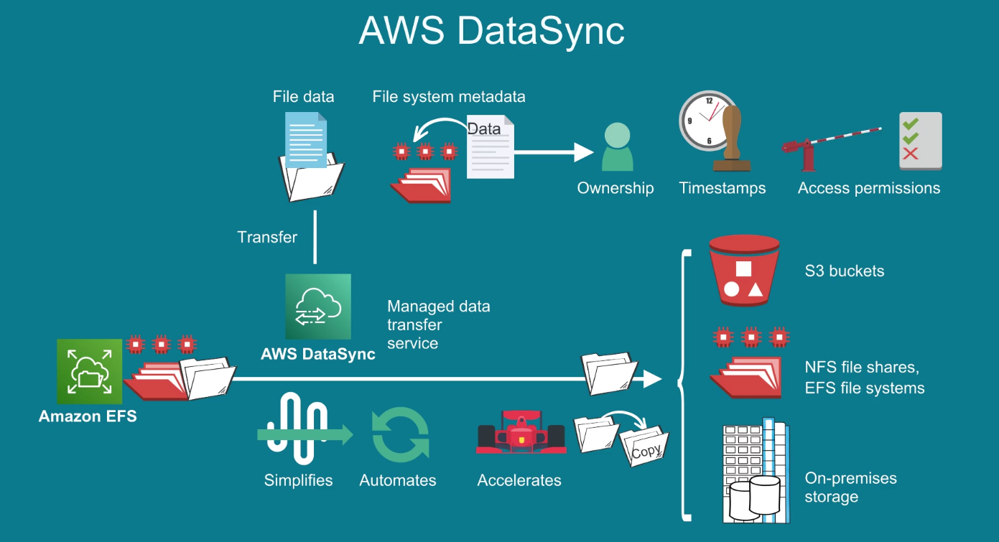
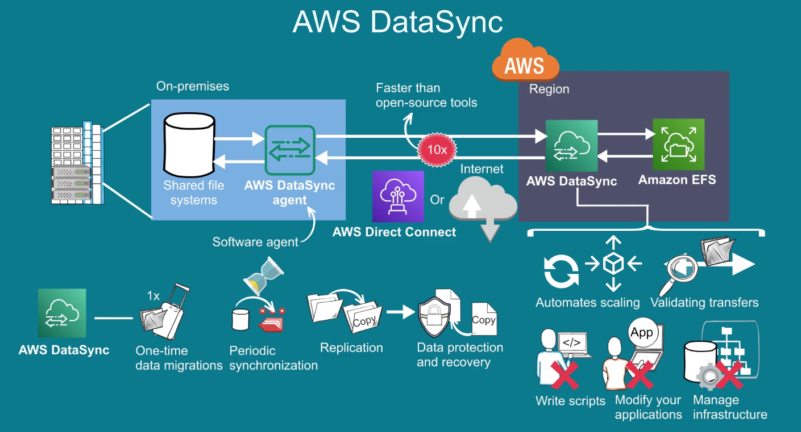
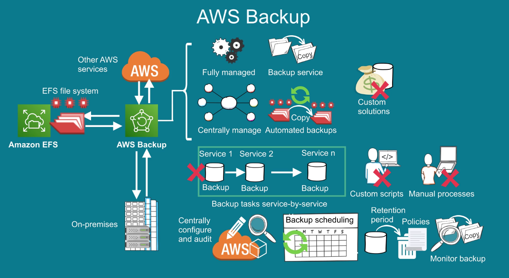

- [EFS - Elastic File System](#efs---elastic-file-system)
  - [Overview](#overview)
    - [Protocols Supported for File Transfer](#protocols-supported-for-file-transfer)
    - [Availability \& Durability](#availability--durability)
    - [Use Cases](#use-cases)
    - [File Systems](#file-systems)
  - [Features](#features)
    - [Storage Classes and Lifecycle Management](#storage-classes-and-lifecycle-management)
    - [Performance Modes](#performance-modes)
    - [Throughput Modes](#throughput-modes)
    - [Encryption](#encryption)
    - [Containers and Serverless File Storage](#containers-and-serverless-file-storage)
  - [Data Transfer \& Backup](#data-transfer--backup)
    - [Data Transfer](#data-transfer)
    - [AWS Backup](#aws-backup)

# EFS - Elastic File System

## Overview

Is a secure transfer service that enables you to transfer files into and out of AWS storage services.

It manages file storage infrastructure, meaning you avoid the complexity of deploying, patching & maintaining complex file system configurations.

### Protocols Supported for File Transfer

- Secure Shell (SSH) File Transfer Protocol (SFTP): version 3
- File Transfer Protocol Secure (FTPS)
- File Transfer Protocol (FTP)
- Applicability Statement 2 (AS2)

Is highly scalable, it scales on demand of petabytes without disrupting applications, growing and shrinking automatically as you add or remove files.

Is designed to provide massively parallel shared access to thousands of EC2 instances where they can access the data in EFS at the same time. This enables applications to achieve high levels of aggregate throughput and IOPS with consistent low latencies.

### Availability & Durability

It stores data across multiple AZs and you can access across diferent AZs and VPCs. 

On premises servers can acces using AWS Direct Connect or AWS VPN.

### Use Cases

- Home directories
- Business critical applications
- Web Serving
- Content management
- Big Data Analytics
- Application development and testing
- Media and Entertainment workflows
- Database Backups
- Container Storage

### File Systems

It is designed for Linux type of application. It offers two File Systems to choose from.

- Amazon FSx for Windows File Server.
- Amazon FSx for Lustre. (For compute intensive workloads)

## Features

### Storage Classes and Lifecycle Management

EFS offers two storage classes.

**Standard Storage Class** 

Used to access frequently accessed stored files.

**Infrequent Access Storage Class (EFS IA)**

It is a lower cost designed to storing files not accessed everyday. 

You can start using it by enabling EFS Lifecycle management, when enabled it migrates files from STD to IA after a set period of time with defined Lifecycle Policy.

Using the Industry Accepted Estimate where 20% of data is actively used and 80% is infrequently accessed you can store your files in EFS at an effective price of $0.08 / GB-month.

### Performance Modes 

There are 2 performance modes to choose from:

**General Performance**

Provides the lowest latencies per file system operation and achieve this for random or sequential IO patterns.

**MAX IO**

Can achieve higher aggregate throughput and operations per sec and is ideal for highly parallelized applications that can scale up to thousands of EC2 instances 

### Throughput Modes

They help determine the system overall throughput can achieve. It offers 2 trhoughput modes.

**Bursting**

The throughput scales with the size of the file system dynamically bursting to support the spiky nature of many File-based workloads.

**Provisioned**

Designed to support applications that require higher dedicated throughput than the default bursting mode.

Can be configured independently with the amount of data stored in the file system.

### Encryption

Supports encryption of data in transit at rest, providing comprehensive encryption solution.

Data at rest is transparently encrypted using encryption keys managed by AWS Key Management Service (KMS).

Encryption of data in transit uses industry standard Transport Layer Security (TLS), to secure Network traffic without having to modify your applications.

### Containers and Serverless File Storage

It's integrated with Serverless Compute Services from AWS that require shared storage for Latency-sensitive and IOPS-heavy workloads at any scale.

In a single step EFS provides applications running on ECS, EKS, Fargate & Lambda access to shared file system for stateful workloads.

## Data Transfer & Backup

### Data Transfer

Moving your EFS file data can be done by using [AWS DataSync](https://docs.aws.amazon.com/es_es/datasync/latest/userguide/what-is-datasync.html) a managed data transfer service that simplifies, automates & accelerates copying data between NFS file shares, EFS file systems, S3 Buckets and On-Premises storage.

DataSync can transfer file data and also file system metadata such as ownership, timestamps and access permissions.

DataSync uses a software agent to connect to your EFS file systems, it automates scaling and validating trasnfers so you don't have to write scripts, modify your applications or manage infrastructure.

You can transfer active data sets over [AWS Direct Connect](https://docs.aws.amazon.com/directconnect/latest/UserGuide/Welcome.html) or the internet at the speed of 10x than open-source tools.

You can use DataSync for:
- One-time data migration.
- Ongoing workflows with Periodic synchronization. 
- Replication for data protection and recovery.

### AWS Backup

[AWS Backup](https://docs.aws.amazon.com/aws-backup/latest/devguide/whatisbackup.html) is a fully managed backup service that makes it easy to centrally manage and automate backups of your EFS file systems, removing the need for custom solutions. 

It centralizes the backup of other AWS Services as well as On-Premise. You do not need to perform backup tasks service by service, create custom scripts and manual processes for the backup activities.

You can centrally configure and audit backup-scheduling, retention period policies and monitor backup activity. 

