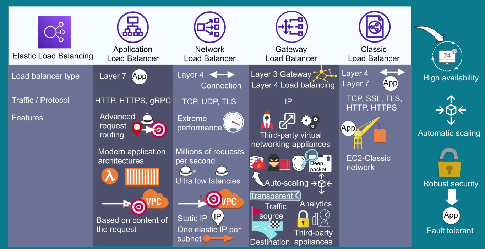

# ELB - Elastic Load Balancing

Automatically distributes incoming traffic across multiple targets, such as EC2, containers and IP addresses, in one or more AZs.
It automatically scales your load balancer as incoming traffic changes over time. 

It can be internal or internet facing.

Internet facing can route requests from clients over the internet. On the other hand internal load balancers can only route requests from clients from the VPC.

## Types

ELB offers 4 types of load balancer, all of them have: 

- High availability.
- Automatic scaling.
- Robust security.

