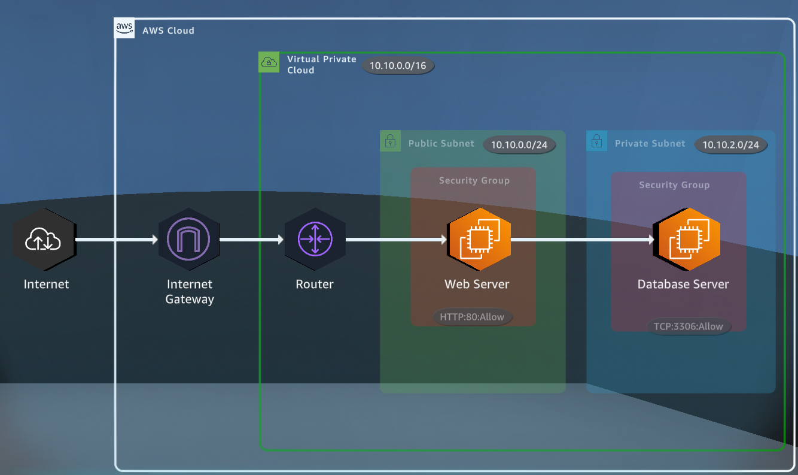
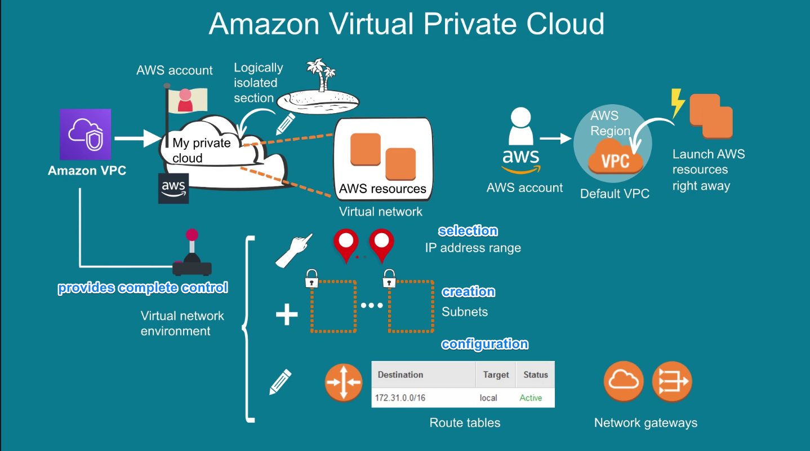
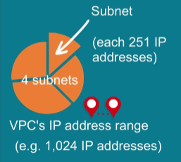
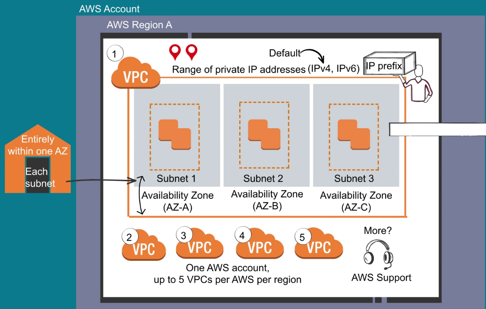
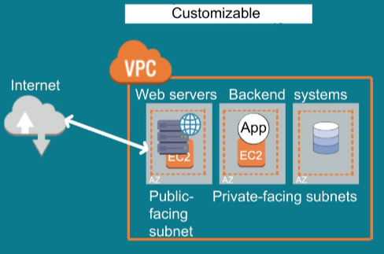
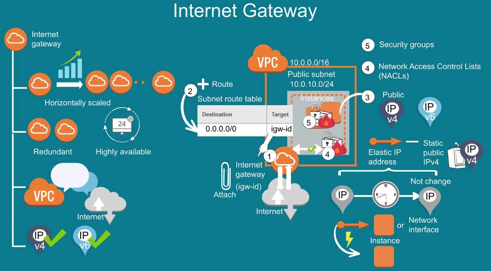
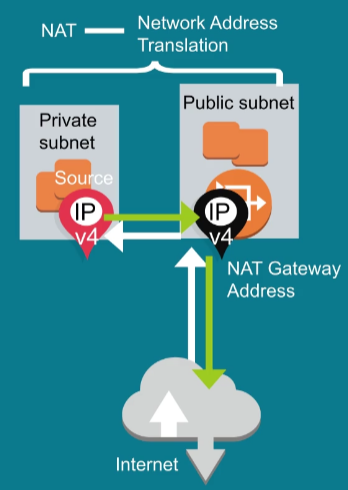
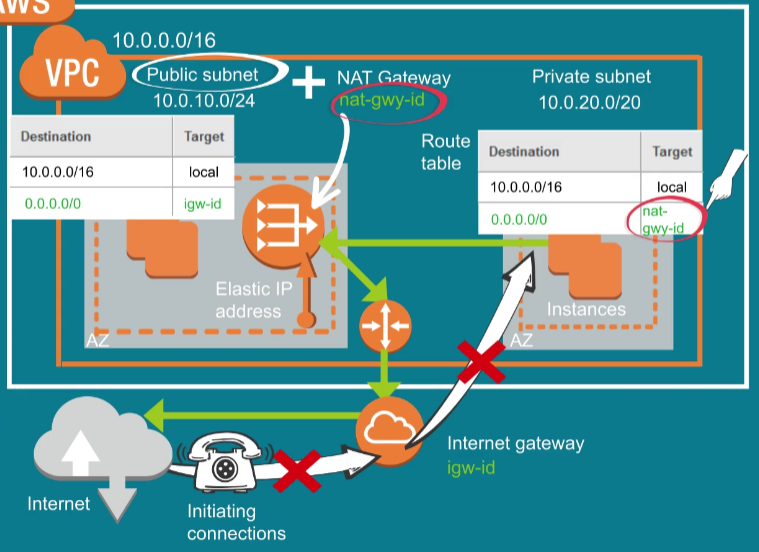
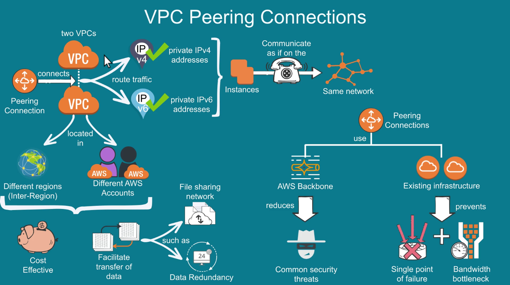

# VPC - [Virtual Private Cloud](https://docs.aws.amazon.com/vpc/latest/userguide/what-is-amazon-vpc.html)

It's like your own private cloud but within AWS.

- It allows to launch resources in a virtual network that you define.
- AWS account comes with predefined default VPC in each region, you can launch resources on default VPC right away. 

For creating it you assign a range of IP address, it spans all AZ in a region, you can add subnets in each AZ.

**Subnet**

It's a partition of a VPC IP address range.

**VPC Example**

**Security**

VPC is secured through security groups, ie: store data in S3 and allow access only to instances inside VPC.

## Internet Gateway

It **allows communication** between **internet** and **VPC**.

Is **horizontally scaled**, **redundant** and **highly available** by default.

### Enable Internet Access to instances in a VPC subnet

1. Attach Internet Gateway to the VPC.
2. Add a Route to the subnet Route Table and point the Route to the Internet Gateway.
3. Make sure your instances have public IPv4, IPv6 or Elastic IP Address (static IPv4 address that can be moved from one instance to another).
4. Make sure that Security Groups and Network Access Control Lists (NACLs) that allow relevant traffic to float out of the instances.

On the other hand for private subnet you need a NAT gateway to the public internet but preventing the internet to initiate connections to the instances.

When traffic goes to the internet the source IPv4 of the private subnet is translated to the NAT Gateway IPv4 of the public subnet. 

For the response traffic, NAT Gateway translates the address back to the private IPv4 address.

**NAT Gateway**

To create it you must specify the public subnet in which the NAT Gateway should reside. You must also specify an Elastic IP Address to associate to the NAT Gateway when you create it.

After it's created you must update the Route Table for your private subnet to point internet traffic to the NAT Gateway.

## Peering Connections

It's a networking connection between 2 VPCs. It allows to route traffic using IPv4/IPv6. Instances can communicate with each other as if they were in the same network.

They can be in different regions or AWS accounts.

**Benefits**

- Cost effective.
- Facilitate the transfer of data.
- Use existing infrastructure which prevents single point of failure and bandwidth bottlenecks.

