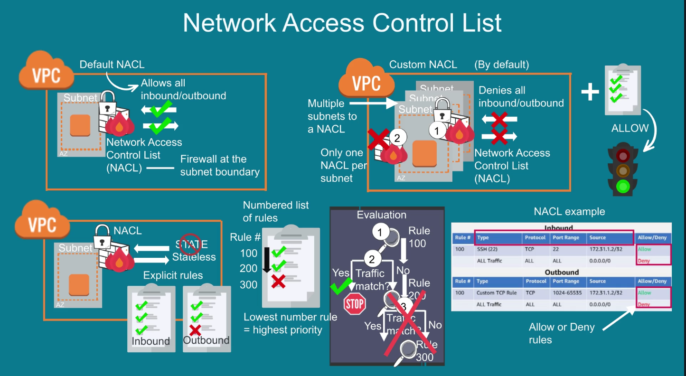
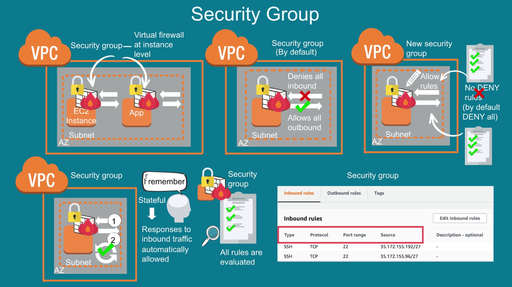
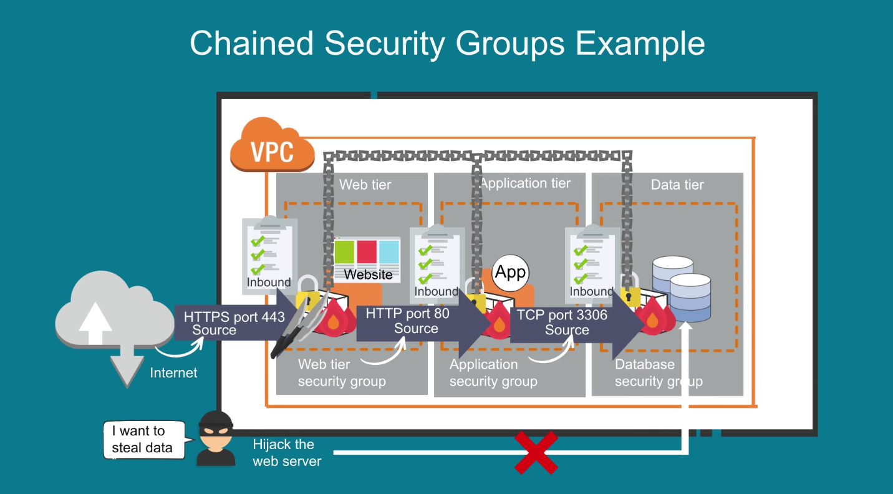
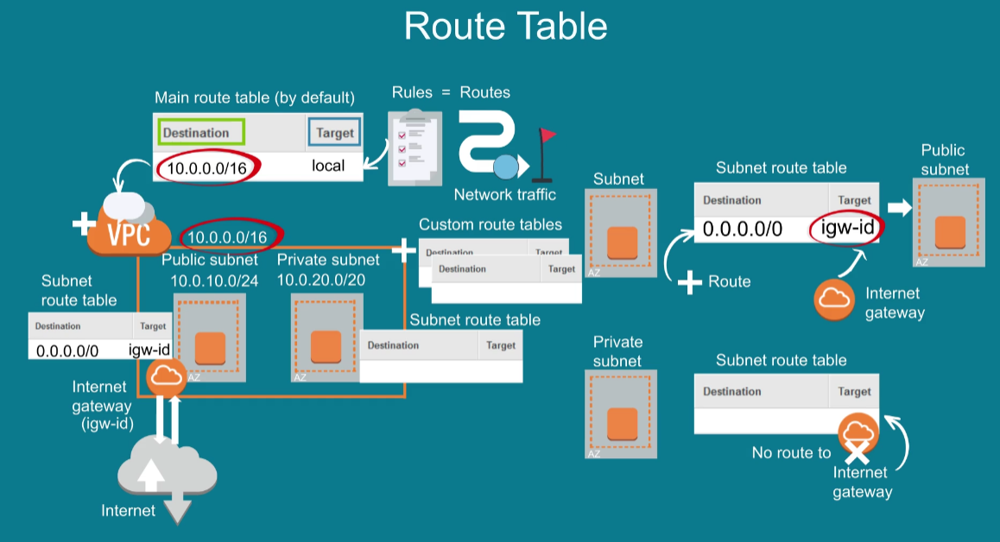
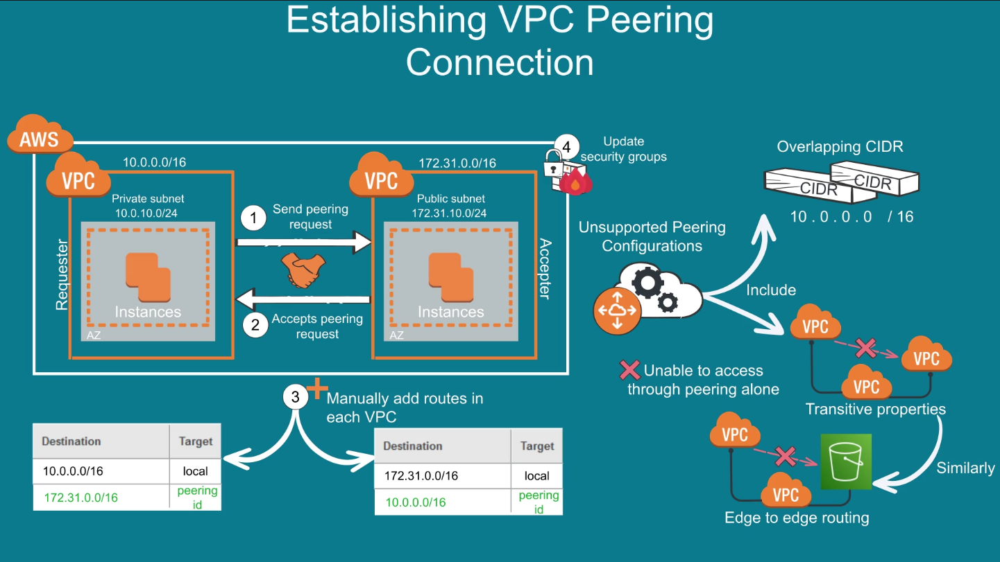

# VPC - [Virtual Private Cloud](https://docs.aws.amazon.com/vpc/latest/userguide/what-is-amazon-vpc.html)

It's like your own private cloud but within AWS.

- It allows to launch resources in a virtual network that you define.
- AWS account comes with predefined default VPC in each region, you can launch resources on default VPC right away. 

For creating it you assign a range of IP address, it spans all AZ in a region, you can add subnets in each AZ.

**Subnet**

It's a partition of a VPC IP address range.

**VPC Example**

## Security

VPC is secured through security groups, ie: store data in S3 and allow access only to instances inside VPC.

### NACL - Network Access Control List

Is the firewall of the subnet boundary, VPC comes with a default NACL that allows inbound/outbound traffic.

You can create a custom NACL, it denies all inbound/outbound network traffic by default until ALLOW rules are added. 

You can associate multiple subnets to a NACL but only one can be associated at a time.

They are stateless and require explicit rules for inbound/outbound network traffic. It contains a numbered list of rules, starting with the lowest number which has higher priority. 

If the traffic matches the rule the allow or deny rule is applied.You can configure rules based on the **Type**, **Protocol**, **Port Range** & **Source**.

### Security Group

Is a virtual firewall at the instance level to control inbound/outbound traffic. By default it denies all inbound and allows all outbound traffic.

When you create a security group you can define Allow rules to control incoming/outcoming traffic.

Security groups are stateful, responses to inbound traffic are automatically allowed. 

Unlike NACL all security groups are evaluated before deciding to allow traffic.

Traffic can be restricted by **Type**, **Protocol**, **Port Range** & **Source**.

### Example - Chained Security

## Internet Gateway

It **allows communication** between **internet** and **VPC**.

Is **horizontally scaled**, **redundant** and **highly available** by default.

### Enable Internet Access to instances in a VPC subnet

1. Attach Internet Gateway to the VPC.
2. Add a Route to the subnet Route Table and point the Route to the Internet Gateway.
3. Make sure your instances have public IPv4, IPv6 or Elastic IP Address (static IPv4 address that can be moved from one instance to another).
4. Make sure that Security Groups and Network Access Control Lists (NACLs) that allow relevant traffic to float out of the instances.

On the other hand for private subnet you need a NAT gateway to the public internet but preventing the internet to initiate connections to the instances.

When traffic goes to the internet the source IPv4 of the private subnet is translated to the NAT Gateway IPv4 of the public subnet. 

For the response traffic, NAT Gateway translates the address back to the private IPv4 address.

**NAT Gateway**

To create it you must specify the public subnet in which the NAT Gateway should reside. You must also specify an Elastic IP Address to associate to the NAT Gateway when you create it.

After it's created you must update the Route Table for your private subnet to point internet traffic to the NAT Gateway.

## Route Table

It contains a set of rules called **Routes** that are used to determine where Network Traffic is directed.
When a VPC is created it automatically has a Route Table (by default). You can create custom Route Tables.

Each Route in a table specifies a **destination** & **target**.

Each subnet in a VPC must be associated with a Route Table, you use a public Subnet for resources connected to the internet and a private Subnet for resources that wont be connected to the internet.

You can make a subnet public by adding a Route in the Subnet Route Table to an Internet Gateway to support inbound and outbound access to the public internet.

A private route doesn't have a route to the Internet Gateway in the Subnet Route Table.

## Peering Connections

It's a networking connection between 2 VPCs. It allows to route traffic using IPv4/IPv6. Instances can communicate with each other as if they were in the same network.

They can be in different regions or AWS accounts.

**Benefits**

- Cost effective.
- Facilitate the transfer of data.
- Use existing infrastructure which prevents single point of failure and bandwidth bottlenecks.

### Establishing VPC Peering Connection

