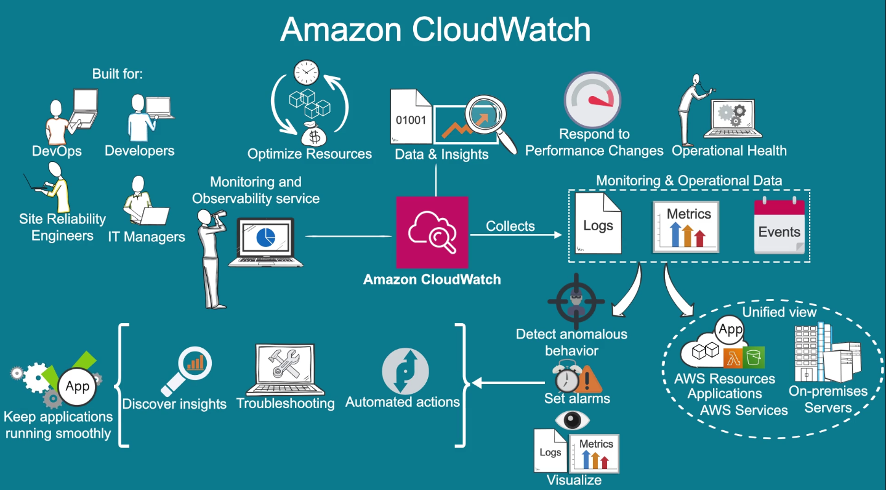
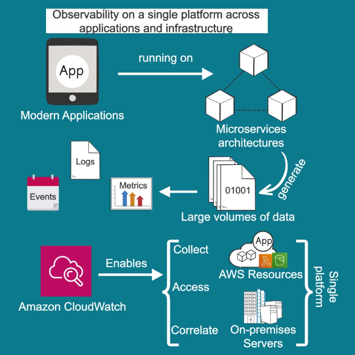
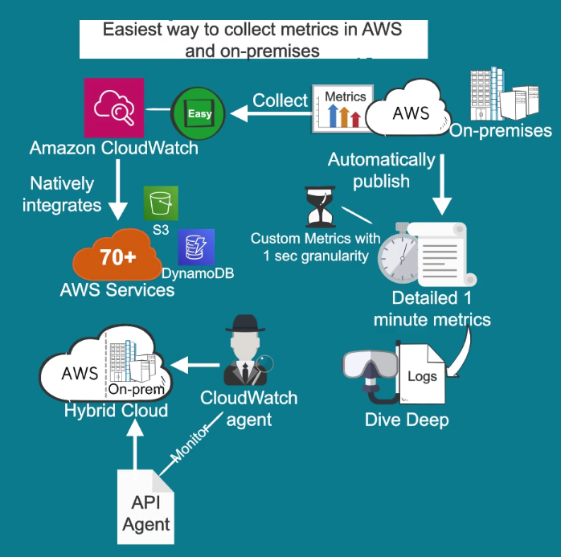
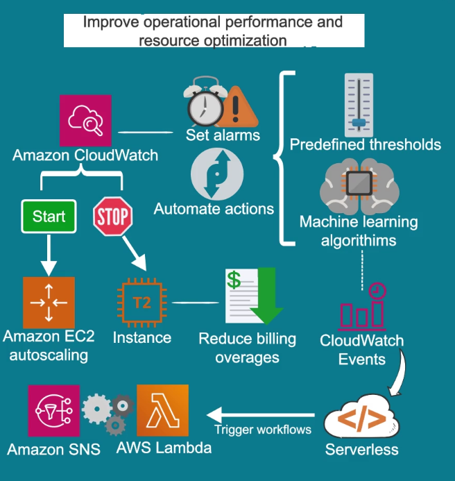
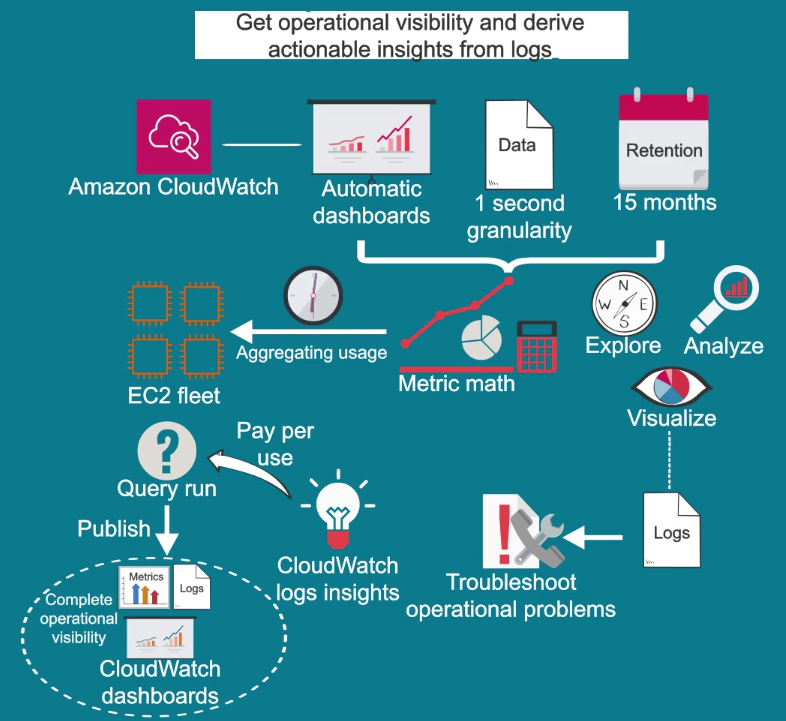

# Cloudwatch

## Overview

Is a monitoring and observability service built for: 

- DevOps
- Developers
- Site Reliability Engineers
- IT Managers
  
It provides data and actionable insights to monitor your applications, respond to system performance changes, optimize resource utilization and get a unified view of operational health.

It collects monitoring & operational data, in the form of:

- Logs
- Metrics
- Events

Providing a unified view of AWS & On-Premises resources, applications and services.

## Utility

- Detect anomalous use behavior in your environments.
- Set alarms.
- Visualize logs and metrics side by side.
  - Take automated actions.
  - Troubleshoot issues.
  - Discover insights to keep your app running smoothly. 

## Benefits

Enables observability on a single platform across applications and infrastructure.

Modern applications running on microservices architectures generate large volumes of data in the form of metrics, logs and events.

Cloudwatch enables to collect, access and correlate this data on a single platform across all your aws resources, applications and services.

It makes it easy to collect all this data because it integrates natively more than 70 services.

It automatically publishes 1 minute metrics & custom metrics with 1 sec granularity so you can dive deep into your logs for additional context.

You can use it on hybrid cloud architectures by using CloudWatch Agent or API agent to monitor your On-Premises resources.

**Improves operational performance and resource optimization**

You can set alarms and automated actions based on predefined thesholds or machine learning algorithms. 

For instance it can start EC2 autoscaling automatically or stop an instance to reduce billing overages.

You can also use CloudWatch events for serverless to trigger workflows for services like Lambda & SNS.

**Get operational and derive actionable insights from logs**

CloudWatch provides automatic dashboards with one sec granularity and up to 15 month of metrics storage and retention.

It can also provide metric math to gain insights such as aggregating usage across an entire fleet of EC2 instances.
You can also explore, analyze & visualize logs so you can troubleshoot operational problems.

With CloudWatch logs insights you only pay for the queries you run, you can then publish your metrics and logs to CloudWatch dashboards for complete operational visibility.

