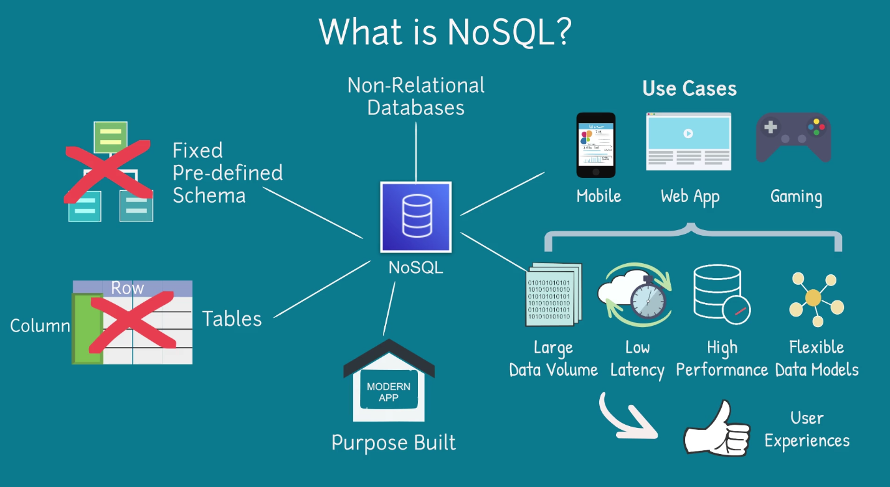
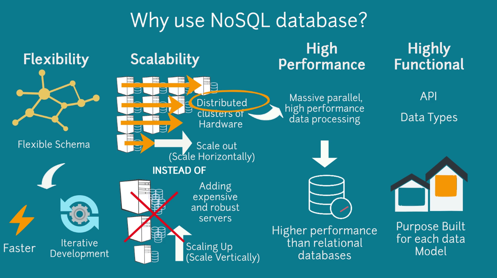
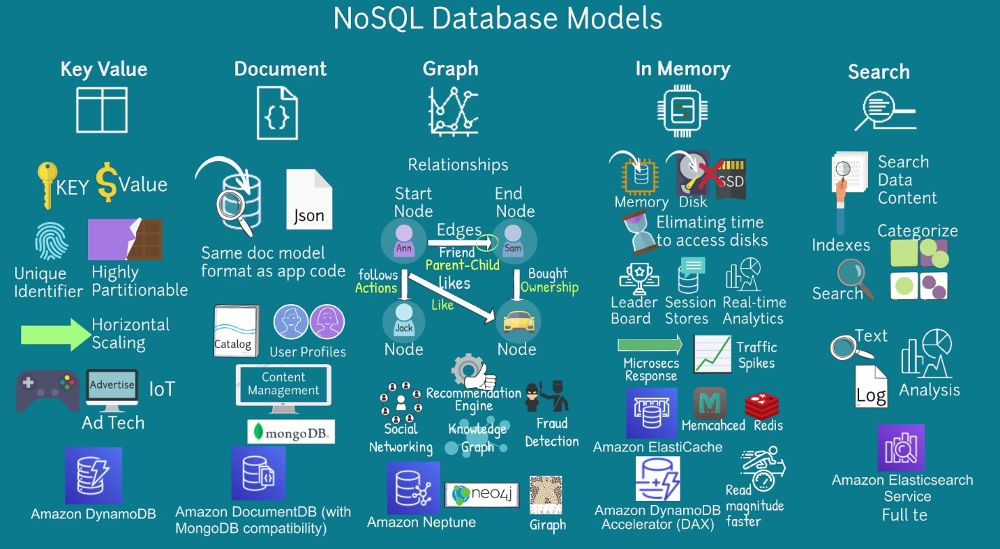

- [RDS](#rds)
  - [Vailability \& Durability](#vailability--durability)
    - [Automated Backups](#automated-backups)
    - [Database spanshots](#database-spanshots)
    - [Automatic Host Replacement](#automatic-host-replacement)
    - [Multi AZ deployments](#multi-az-deployments)
- [NoSQL](#nosql)
  - [Why would you use a NoSQL DB?](#why-would-you-use-a-nosql-db)
  - [NoSQL Data Models](#nosql-data-models)
    - [Key Value](#key-value)
    - [Document](#document)
    - [Graph](#graph)
    - [In Memory](#in-memory)
    - [Search](#search)

# RDS

Is a managed relational database service. It automates time consuming tasks, such as hardware provisioning, db setup, patching and backups. 

It offers 6 familiar db engines to choose: Aurora, PostgreSQL, MySQL, MariaDB, Oracle & Microsoft SQL.

You can use [DMS - (Database Migration Service)](https://www.google.com/search?q=database+migration+service&rlz=1C1CHBF_esAR1013AR1013&oq=database+migration+service&aqs=chrome..69i57j0i20i263i512j0i512l5j69i61.3104j0j9&sourceid=chrome&ie=UTF-8) to migrate, replicate existing databases to RDS.

It enhances reliability for critical production databases, including automated backups, db snapshots & automatic host replacement.

## Vailability & Durability

### Automated Backups

RDS will backup dbs and transaction logs and saves them in S3 for user specified retention period. The user retention period can be configured up to 35 days.

Automated backups allow point-in-time-recovery for your DB instance, it allows to restore your db instance in any sec during a retention period up to the last 5 minutes.

### Database spanshots

Are user initiated backup of an RDS instance stored in S3 that are kept until explicitly deleted. You can create a new DB instance from DB snapshots. You are only billed for incremental storage use.

### Automatic Host Replacement

RDS will automatically replace compute instance powering your deployment in the event of a hardware failure.

### Multi AZ deployments

They provide high availability and durability to the DB instances making them perfect fit for production database workloads. 

When you provision a multi AZ DB instance, RDS synchronously replicates the data to standby instance in AZ in the same or different region.

If the primary instance doesn't work because of failure:
1. The standby instance becomes the primary instance.
2. Data is replicated to a new standby instance to retain high availability.
3. Endpoint for new instance remains the same.

Manual administration for this process isn't required.

# NoSQL

It stands for Non-Relational Databases, they don't have fixed predefined schema and Row/Column tables. They are great for gaming, mobile and web applications. 

Benefits:
- large data volume
- Low latency
- High performance
- Flexible data models

## Why would you use a NoSQL DB?

- **Flexibility:** a flexible schema provides faster and iterative development.
- **Scalability:** they scale out (horizontally) with distributed clusters of hardware insted of scaling up (vertically) like SQL adding more expensive and robust servers.
- **High performance:** they are distributed and fit for massive parallel, high performance data processing.
- **Highly functional:** API and Data Types that are purpose built for each data model.

## NoSQL Data Models

### Key Value

They use Key Value to store data. The **Key** is a **Unique Identifier**. They are highly partionable and scale horizontally.

Use cases: 
- Gaming
- Ad Tech
- IoT

AWS Service: [Dynamo DB.](https://www.dynamodbguide.com/what-is-dynamo-db/)

### Document

Is designed to store and query data as JSON, this makes it easier for developers as they are using the same document model format as the application code.

Use cases:
- Catalogs
- User Profiles
- Content Management System (Where each document is unique & evolves over time)

AWS Service: [AWS DocumentDB (With MongoDB compatibility)](https://docs.aws.amazon.com/documentdb/latest/developerguide/what-is.html)

### Graph

It's purpose is to store and navigate **relationships**. Nodes store data entities, Edges store relationships between entities and it always has a start node, end node, type and direction. Edges can describe parent-child relationships, actions, ownership and a like.

Use cases:
- Social Networking
- Recommendation Engine
- Fraud Detection
- Knowledge Graph

AWS Service: [Amazon Neptune.](https://docs.aws.amazon.com/neptune/latest/userguide/intro.html)

### In Memory

It rellies primarily on memory for data storage in contrast to DBs that store data in disk or SSD. They are design to obtain minimal response time by eliminating the need to access disks. 

It's good for aplications that require microsecs responses and have traffic spikes.

Use cases:

- Gaming Leader Boards
- Session Stores
- Real-time analytics

AWS Services: 
- [Amazon ElasticCache](https://docs.aws.amazon.com/AmazonElastiCache/latest/red-ug/WhatIs.html) offers Memcached & Redis.
- [Amazon DynamoDB Accelerator (DAX)](https://docs.aws.amazon.com/amazondynamodb/latest/developerguide/DAX.html), which makes DynamoDB read in order of magnitude faster.

### Search

A Search engine DB is dedicated to the search of data content. They use indexes to categorize similar characteristics about data and facilitate search capability.

Use cases:

- Text
- Logs
- Analysis

AWS Service: [Amazon Elasticsearch.](https://aws.amazon.com/what-is/elasticsearch/)

