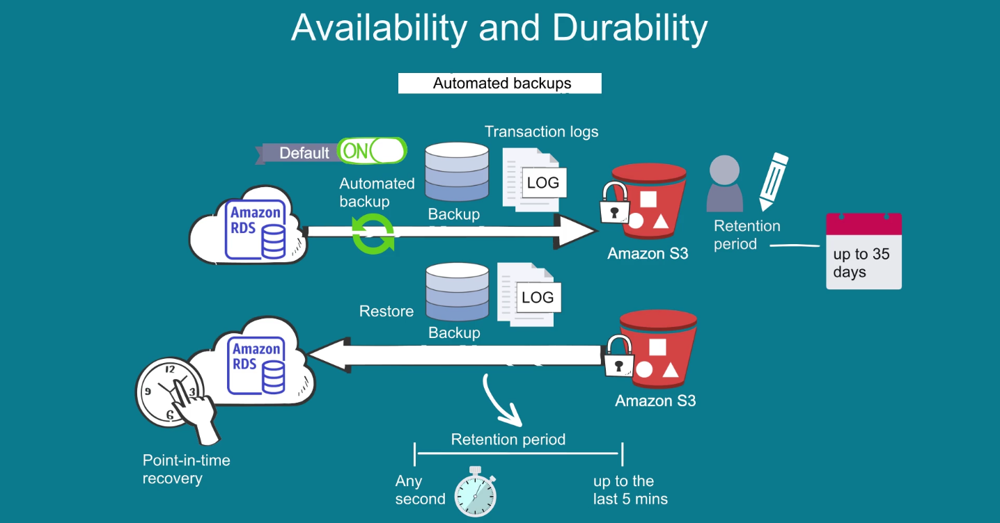
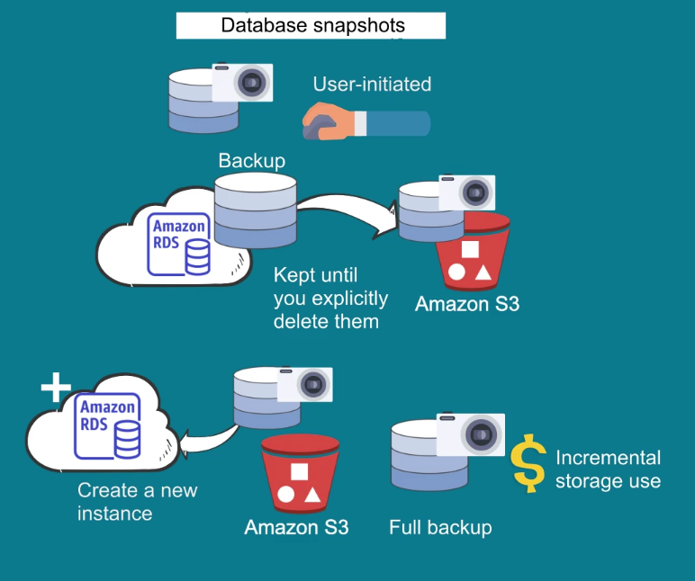
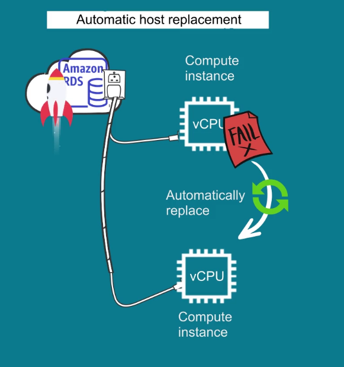

# RDS

Is a managed relational database service. It automates time consuming tasks, such as hardware provisioning, db setup, patching and backups. 

It offers 6 familiar db engines to choose: Aurora, PostgreSQL, MySQL, MariaDB, Oracle & Microsoft SQL.

You can use [DMS - (Database Migration Service)](https://www.google.com/search?q=database+migration+service&rlz=1C1CHBF_esAR1013AR1013&oq=database+migration+service&aqs=chrome..69i57j0i20i263i512j0i512l5j69i61.3104j0j9&sourceid=chrome&ie=UTF-8) to migrate, replicate existing databases to RDS.

It enhances reliability for critical production databases, including automated backups, db snapshots & automatic host replacement.

## Vailability & Durability

### Automated Backups

RDS will backup dbs and transaction logs and saves them in S3 for user specified retention period. The user retention period can be configured up to 35 days.

Automated backups allow point-in-time-recovery for your DB instance, it allows to restore your db instance in any sec during a retention period up to the last 5 minutes.

### Database spanshots

Are user initiated backup of an RDS instance stored in S3 that are kept until explicitly deleted. You can create a new DB instance from DB snapshots. You are only billed for incremental storage use.

### Automatic Host Replacement

RDS will automatically replace compute instance powering your deployment in the event of a hardware failure.

### Multi AZ deployments

They provide high availability and durability to the DB instances making them perfect fit for production database workloads. 

When you provision a multi AZ DB instance, RDS synchronously replicates the data to standby instance in AZ in the same or different region.

If the primary instance doesn't work because of failure:
1. The standby instance becomes the primary instance.
2. Data is replicated to a new standby instance to retain high availability.
3. Endpoint for new instance remains the same.

Manual administration for this process isn't required.